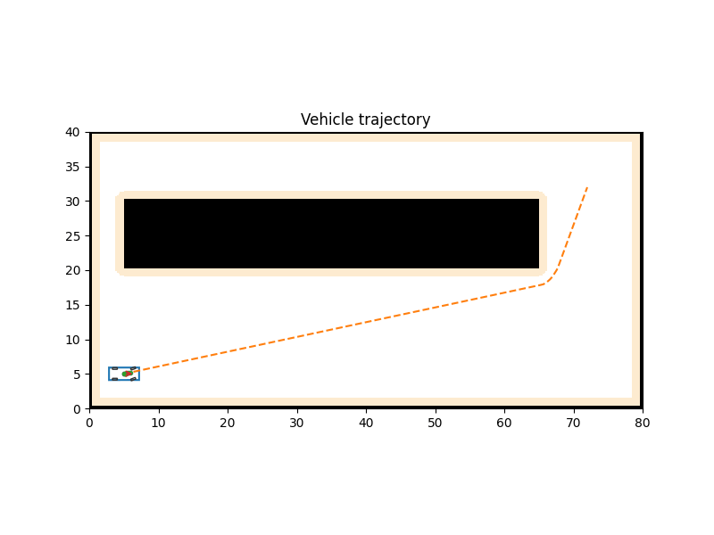

# FMT-MPC

A modular Fast Marching Tree (FMT) planning and control stack for ground vehicles. The stack blends a safety-aware global planner, a model predictive controller (MPC), a deterministic bicycle-model simulator, and rich diagnostics to plan, track, and analyze end-to-end driving scenarios.

<p align="center">
<table style="width:100%; text-align:center;">
  <tr>
    <td>
      
    </td>
    <td>
      
    </td>
  </tr>
</table>
</p>

> [!NOTE]
> This **README** is comprehensive. Skim the section headers first, then dive into the examples and checklists.

## 1. Overview

FMT builds a graph using sampled points and expands a tree guided by a cost-to-come metric, with safety checks against an inflated occupancy grid. The MPC tracks a smoothed corridor, while a deterministic kinematic bicycle model simulates vehicle motion. Outputs include annotated plots, animations, logs, and metrics suitable for iteration and analysis.

> [!IMPORTANT]
> The stack is designed for deterministic runs. Keep seeds, sampling counts, and integration steps fixed when comparing results.

---

## 2. Key Features

* Modular packages in `src/` for mapping, planning, tracking, simulation, visualization, and IO.
* Safety-aware mapping with obstacle inflation and corridor validation.
* Goal-biased FMT planner supporting rewiring, optional pruning, spline smoothing, and waypoint annotations (yaw, speed).
* MPC tracker that samples the corridor by arc length, enforces cruise speed, and provides feedforward diagnostics.
* Deterministic simulation using a kinematic bicycle model with structured metrics (slip, lateral force, corridor progress, cross-track error).
* Visualization modules for dashboards, path growth, and animations.
* Scenario-driven experimentation via YAML configs in `configs/`.
* CLI tooling for planning only, single-step tracking, end-to-end runs, and map export.
* Pytest suite across configuration loading and pipeline integration.

> [!TIP]
> Use `plan_only` first to tune map inflation and connection radius cheaply before running `run_e2e`.

---

## 3. Quick Start

```bash
# 1) Create and activate a Python 3.12 environment
python -m venv .venv
source .venv/bin/activate

# 2) Install
pip install -r requirements.txt
# or for dev
pip install -e .[dev]

# 3) Ensure sources are visible if not installing
export PYTHONPATH="$(pwd)/src"

# 4) Run a scenario
python -m src.cli configs/high_speed.yaml run_e2e
```

Artifacts (plots, gifs, logs) will be written to the configured output directory.

> [!IMPORTANT]
> Always run in an activated virtual environment to ensure consistent dependency resolution.

---

## 4. Installation

* Python: 3.12
* Dependencies: `requirements.txt`, mirrored in `pyproject.toml`.

Developer install with extras:

```bash
pip install -e .[dev]
```

Optional docs tooling:

```bash
pip install mkdocs mkdocs-material
```

> [!CAUTION]
> Mixing system and user Python packages can lead to subtle import errors. Prefer a clean virtual environment.

---

## 5. Repository Layout

```
src/
  cli/            # CLI entry points: plan_only, track_only, run_e2e, export_map
  common/         # Dataclasses, geometry helpers, seeded randomness, logging utils
  io_utils/       # Map loading and YAML-driven generation helpers
  mapping/        # Occupancy grid, inflation, corridor validation
  planning/       # Goal-biased FMT planner, pruning, smoothing
  tracking/       # MPC tracker, horizon utilities, corridor sampling
  vehicle/        # Kinematic bicycle model (deterministic integrator)
  sim/            # Simulator, structured logging, E2E orchestration
  vis/            # Dashboard, animation, FMT debug rendering
configs/          # Experiment YAMLs (conservative.yaml, high_speed.yaml, etc.)
maps/             # Map geometry inputs (PNG; generated outputs are ignored)
tests/            # Pytest coverage for config loading and pipeline integration
docs/             # MkDocs site (math-enabled chapters, strict build)
```

---

## 6. Concepts and Architecture

* Mapping:
  * Loads a binary occupancy grid (white=free, black=occupied).
  * Applies configurable obstacle inflation and validates corridors.
* Planning (FMT):
  * Samples N points, connects within a radius, expands tree with a cost-to-come heuristic.
  * Rewiring and optional pruning reduce path cost and remove low-value edges.
  * Smoothing via cubic splines produces a corridor with annotated yaw and target speed.
* Tracking (MPC):
  * Samples the smoothed corridor by arc length.
  * Optimizes steering and acceleration while respecting speed targets and goal slowdown.
* Simulation:
  * Kinematic bicycle model integrates state deterministically per time step.
  * Produces a `SimulationLog` with per-step summaries and control feeds.
* Visualization:
  * Diagnostics distinguish free, inflated, and hard obstacle cells.
  * Multi-panel dashboards and animations are generated from logs and states.

> [!NOTE]
> Determinism: fixed seeds, fixed iteration counts, and explicit clipping are used where applicable.

---

## 7. Configuration Schema

Each YAML file populates `ExperimentConfig`. The following fields are commonly used.

```yaml
map:
  spec_path: maps/map_raw.png          # or YAML spec used by generator
  resolution: 0.20                     # meters per pixel
  inflate_radius: 0.6                  # safety inflation in meters
  safety_margin: 0.4                   # corridor clearance in meters
  validate_corridor: true

planner:
  samples: 1500
  connection_radius: 2.5               # meters
  goal_bias: 0.10
  rewire: true
  prune: false
  smooth:
    enabled: true
    spline: catmull_rom
  nominal_speed: 6.0                   # m/s

tracker:
  horizon_steps: 15
  dt: 0.10                             # seconds
  q_weights: [1.0, 1.0, 0.2]           # example positional/error weights
  r_weights: [0.1, 0.1]                # input cost
  cruise_speed: 6.0
  goal_slowdown_radius: 5.0            # meters

vehicle:
  wheelbase: 2.7
  max_steer: 0.6                       # radians
  max_accel: 2.5                       # m/s^2
  max_decel: -3.0                      # m/s^2

simulation:
  dt: 0.02                             # integrator step
  duration: 20.0                       # seconds
  log_states: true

visualization:
  output_dir: artifacts/high_speed
  show_planner_debug: false
  planner_debug_filename: artifacts/high_speed/fmt_tree.png
  animate_planner: true
  planner_animation_filename: artifacts/high_speed/fmt_exploration.gif
  planner_animation_fps: 20
  vehicle_draw:
    wheelbase: 2.7
    width: 1.8
    front_overhang: 0.9
    rear_overhang: 1.0

start: [5.0, 5.0, 0.0]                 # x, y, yaw (radians)
goal:  [72.0, 32.0, 0.0]

# Optional legacy circular obstacles for synthetic tests
obstacles:
  circles: []
```

> [!WARNING]
> Units must be consistent. Distances in meters, angles in radians, time in seconds.

---

## 8. CLI Usage

Base invocation:

```bash
python -m src.cli <CONFIG_PATH> <MODE>
```

Modes:

* `plan_only`: build occupancy grid, run FMT, print path cost, and optionally open FMT debug view.
* `track_only`: run planning and a single MPC update to preview initial control.
* `run_e2e`: full pipeline including simulation, plots, and animations.
* `export_map`: export the inflated occupancy grid referenced by the config as a PNG.

Examples:

```bash
# Explore a conservative scenario
python -m src.cli configs/conservative.yaml plan_only

# Full pipeline with animation for a high-speed corridor
python -m src.cli configs/high_speed.yaml run_e2e

# Cache the inflated grid for a given scenario
python -m src.cli configs/conservative.yaml export_map
```

> [!TIP]
> Enable `visualization.show_planner_debug: true` to inspect samples, edges, and tree growth interactively.

---

## 9. Maps and Environment Generation

Two supported paths:

1. Deterministic script (PNG out):

```bash
python tools/det_occ_map.py --out-prefix maps/map \
  --width-m 80 --height-m 40 --mpc 0.20 --edge-m 0.5 \
  --rect ...  # repeat as needed
```

2. YAML-driven generator:

```bash
python -m src.io_utils.map_generator maps/conservative_map.yaml artifacts/maps/conservative.png
```

> [!IMPORTANT]
> Keep `map.resolution` in the scenario YAML identical to the resolution used when creating the PNG map.

---

## 10. Visualization

Modules in `src/vis/`:

* `dashboard.py`: `plot_simulation(log, cfg)` builds a 9-panel dashboard (map, velocity, acceleration, steering, inputs, errors, corridor progress, lateral force, slip).
* `animation.py`: `animate_simulation(log, cfg, out_path)` renders a GIF of motion and predicted horizons.
* `fmt_debug.py`: `plot_fmt_debug(...)` and `animate_fmt_debug(...)` for static and animated FMT exploration views.

`run_e2e` calls `plot_simulation` and `animate_simulation` automatically when configured.

> [!NOTE]
> The map panel legend differentiates free, inflated, and hard-obstacle cells to confirm clearance.

---

## 11. Logging and Artifacts

Logging is configured via `src.common.logging_utils.configure_logging`:

* Stream handler to console with timestamps and module names.
* File handler mirrored to `output/logs/run_<timestamp>.log`.
Artifacts commonly produced:
* `artifacts/<scenario>/*.png`: dashboards and planner debug plots.
* `artifacts/<scenario>/*.gif`: simulation and planner animations.
* `artifacts/maps/*.png`: exported inflated occupancy grids.
  
> [!CAUTION]
> Ensure the `output/` directory exists and is writable before running long simulations.

---

## 12. Testing and Quality

Run tests:

```bash
pytest
```

Coverage:

```bash
coverage run -m pytest
coverage report
```

Linting:

```bash
ruff check .
black --check .
```

Formatting:

```bash
black .
ruff check . --fix
```

> [!TIP]
> Keep type hints pervasive across modules to improve static checks and maintain clear data flow.

---

## 13. Automation and Workflows

Workflows under `.github/workflows/`:

| Workflow       | Purpose                                   | Trigger      |
| -------------- | ----------------------------------------- | ------------ |
| `ci.yml`       | Orchestrate lint, tests, and build        | Push and PR  |
| `lint.yml`     | `black --check` and `ruff`                | Manual or CI |
| `test.yml`     | Run `pytest`                              | Manual or CI |
| `build.yml`    | Build wheel and sdist                     | Manual or CI |
| `coverage.yml` | Generate and publish Codecov              | Push to main |
| `mkdocs.yml`   | Strict docs build                         | Manual       |
| `release.yml`  | Semantic version and GitHub Release       | Manual       |
| `cd.yml`       | End-to-end simulation and artifact upload | Manual       |

> [!NOTE]
> Many workflows expose `workflow_dispatch` to allow ad hoc, reproducible checks from the GitHub UI.

---

## 14. Extensibility

Common extension points:

* New map validators:
  * Add validators under `mapping/` and register them in the map builder pipeline.
* Planner strategies:
  * Implement alternative connection strategies or cost functions in `planning/`.
  * Keep the sampling seed and connection radius configurable.
* MPC cost and constraints:
  * Adjust weight vectors and bounds in `tracker/`.
  * Maintain consistent horizon, dt, and target speed definitions.
* Vehicle model variants:
  * Introduce new models in `vehicle/` and ensure determinism via fixed-step integration.
* Visualization:
  * Extend panels in `vis/dashboard.py` and reuse helpers in `vis/base.py`.

> [!WARNING]
> Changing units, integration steps, or sampling strategies without adjusting configs will invalidate apples-to-apples comparisons.
