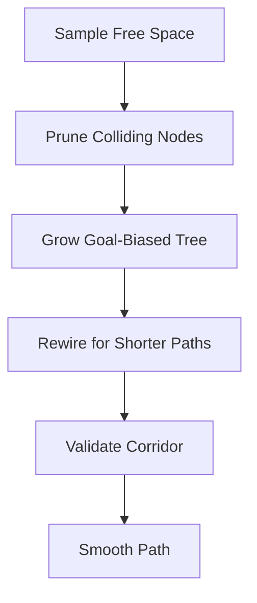

# Planning and Control

## Overview

This document provides a comprehensive and scientific explanation of the **Planning and Control** module, which integrates the **Fast Marching Tree (FMT) planner**, a **curvature-continuous smoothing pipeline**, and a **Model Predictive Control (MPC) tracker**. The system enables efficient motion planning and robust trajectory tracking for ground vehicles operating in static environments represented by occupancy grids. The design emphasizes algorithmic rigor, numerical stability, and safety guarantees.

---

## 1. FMT Planner

### 1.1. Mathematical Foundation

The **Fast Marching Tree (FMT)** planner is a sampling-based algorithm that computes approximately optimal paths in continuous configuration spaces. It operates on an inflated occupancy grid to ensure a fixed safety buffer around obstacles.

Let:

* $\mathcal{X}_{\mathrm{free}} \subset \mathbb{R}^d$: free configuration space.
* $n$: number of sampled configurations.
* $r_n$: connection radius.
* $\gamma > 1$: tunable graph density constant.

The connection radius follows the asymptotically optimal scaling law:

$$
r_n = \gamma \left(\frac{\log n}{n}\right)^{1/d}.
$$

For $d = 2$, this ensures probabilistic completeness and asymptotic optimality under mild assumptions on the environment’s geometry.

### 1.2. Safety-Aware Space Inflation

The occupancy grid consists of:

* $\mathcal{O}$: binary obstacle bitmap.
* $\mathcal{I}$: inflated bitmap obtained by morphological dilation with radius $\delta$.

The inflation radius $\delta$ defines a clearance constraint:

$$
d_{\mathrm{obs}}(x_i) > \delta,
$$

where $d_{\mathrm{obs}}$ is the Euclidean distance transform of the obstacle layer. This ensures the planner rejects any samples violating the safety margin.

### 1.3. Algorithmic Stages

The planner operates through four deterministic phases:

#### 1.3.1. Sampling

Uniform and goal-biased random samples are generated in $\mathcal{X}_{\mathrm{free}}$. A fixed random seed ensures repeatability across runs.

#### 1.3.2. Tree Growth

At each iteration:

* The frontier node $x$ with the minimum accumulated cost is selected.
* All candidate nodes $y$ within distance $r_n$ are inspected:

  $$
  \lVert x - y \rVert_2 \le r_n.
  $$

* The edge $(x, y)$ is accepted only if the discretized segment satisfies

  $$
  d_{\mathrm{obs}}(s) > \delta, \quad \forall s \in [x, y].
  $$

This check ensures no part of the connection crosses inflated obstacles.

#### 1.3.3. Rewiring and Pruning

If a newly discovered path offers a lower cumulative cost, the tree rewires the parent relationship of the node, reducing the path length and improving the optimality bound as $n \to \infty$.

#### 1.3.4. Corridor Validation

After initial path generation, the planner validates the smoothed path’s adherence to the inflated corridor. If a violation occurs, the system falls back to the unsmoothed waypoint chain, maintaining safety guarantees.

### 1.4. Computational Notes

* Each node stores cumulative cost, parent index, and clearance metadata.
* The FMT expansion uses a min-heap for cost ordering, ensuring $O(n \log n)$ complexity.
* Visualization and logging record both successful and rejected connections for diagnostic and reproducibility purposes.

---

## 2. Path Smoothing

### 2.1. Motivation

The raw waypoint path generated by FMT lacks curvature continuity, which can destabilize model-based controllers. A smoothing stage based on **centripetal Catmull–Rom splines** creates a differentiable path suitable for feedforward control and preview-based tracking.

### 2.2. Formulation

Given waypoints $\{ p_i \}_{i=0}^N$, the parameterization uses centripetal spacing:

$$
t_{i+1} = t_i + \lVert p_{i+1} - p_i \rVert_2^{\alpha}, \quad \alpha = \tfrac{1}{2}.
$$

This reduces oscillations near sharp corners and avoids overshooting, a known issue with uniform parameterizations.

### 2.3. Sampling and Safety Revalidation

The spline is resampled at constant arc-length increments $\Delta s$, producing $\{ \tilde{p}_j \}_{j=0}^M$. Each interpolated point is checked against the distance field:

$$
d_{\mathrm{obs}}(\tilde{p}_j) > \delta.
$$

If violations occur, points are clipped to the valid configuration space. This guarantees geometric feasibility post-smoothing.

### 2.4. Output Properties

* **Continuity:** $C^1$ continuity in position and heading.
* **Differentiability:** Required for curvature and velocity computation.
* **Bounded curvature:** Enables stable reference generation for the MPC.

---

## 3. MPC Tracker

### 3.1. Kinematic Bicycle Model

The tracking controller employs the **linearized kinematic bicycle model**. Let the state vector be:

$$
x = [e_y, e_\psi, v, \kappa]^\top,
$$

and control vector:

$$
u = [a, \dot{\delta}]^\top,
$$

where:

* $e_y$: lateral offset error,
* $e_\psi$: heading error,
* $v$: longitudinal velocity,
* $\kappa$: curvature,
* $a$: acceleration input,
* $\dot{\delta}$: steering rate input.

The discrete linearized dynamics are:

$$
x_{k+1} = A_k x_k + B_k u_k + c_k,
$$

where $A_k$ and $B_k$ are Jacobians computed at the current reference state, and $c_k$ accounts for affine offsets from linearization.

### 3.2. Optimal Control Problem

The MPC minimizes a quadratic cost function over a finite horizon $H$:

$$
\begin{aligned}
\min_{x_{0:H},\,u_{0:H-1}} \quad & \sum_{k=0}^{H} \lVert x_k - x_k^{\mathrm{ref}} \rVert_Q^2 + \sum_{k=0}^{H-1} \lVert u_k - u_k^{\mathrm{ref}} \rVert_R^2 \\n\text{s.t.} \quad & x_{k+1} = A_k x_k + B_k u_k + c_k, \\n& v_{\min} \le v_k \le v_{\max}, \\n& |\delta_k| \le \delta_{\max}, \\n& |\dot{\delta}_k| \le \dot{\delta}_{\max}, \\n& x_0 = x_{\mathrm{meas}}.
\end{aligned}
$$

Here:

* $Q$ and $R$ are positive definite weighting matrices.
* $x_k^{\mathrm{ref}}$ and $u_k^{\mathrm{ref}}$ are derived from the smoothed spline.
* Constraints ensure dynamic feasibility and actuator safety.

### 3.3. Execution and Receding Horizon

Only the first optimal control $u_0^*$ is applied. The process repeats at every sampling step, re-linearizing and resolving the optimization. This **receding-horizon strategy** provides feedback correction against disturbances and modeling errors.

### 3.4. Numerical Stability and Solver Implementation

* The QP is solved using a dense active-set or interior-point method (e.g., qpOASES or OSQP).
* Jacobians are updated incrementally for real-time feasibility.
* Constraints are enforced via inequality matrices $Gx \le h$.

### 3.5. Visualization and Logging

During operation:

* Predicted horizons $\{x_k\}_{k=0}^{H}$ are visualized as green dashed lines.
* Logs capture solver iterations, constraint activations, and state deviations.
* All planner and controller metrics are timestamped for post-run correlation.

---

## 4. Summary

The integrated pipeline ensures:

1. **Theoretical optimality:** via FMT’s asymptotic convergence.
2. **Geometric safety:** through inflated obstacle handling and revalidation.
3. **Smooth, differentiable paths:** ensuring controller compatibility.
4. **Dynamic feasibility:** via constrained MPC optimization.

The result is a modular, scientifically grounded motion planning and control framework suitable for autonomous vehicle simulation and deployment.
