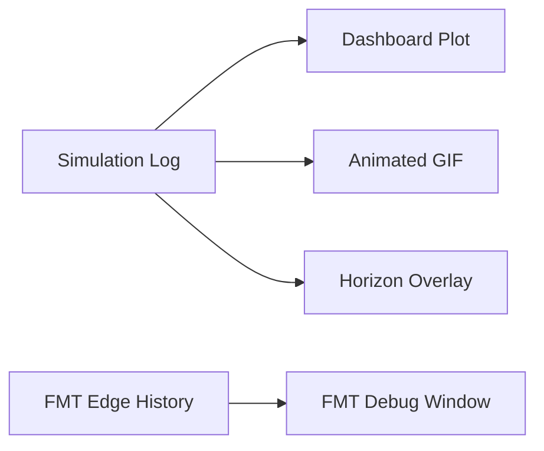

# Simulation and Visualization

## Overview

This document presents a detailed scientific description of the **Simulation** and **Visualization** subsystems, which form the execution and diagnostic layer of the planning and control framework. These modules provide deterministic vehicle motion simulation, consistent data logging, and high-fidelity visualization for both analysis and presentation.

---

## 1. Deterministic Simulation

### 1.1. Model Integration

The simulator (`src/sim/simulator.py`) integrates the **kinematic bicycle model** with a fixed timestep $\Delta t$. The model propagates the vehicle state forward by applying the latest MPC control command while recording dynamic and error metrics. This implementation ensures **bitwise deterministic behavior** and repeatable simulations.

The discrete-time state propagation equations are:

$$
\begin{aligned}
x_{k+1} &= x_k + v_k \cos(\psi_k) \, \Delta t, \
y_{k+1} &= y_k + v_k \sin(\psi_k) \, \Delta t, \
\psi_{k+1} &= \psi_k + \frac{v_k}{L} \tan(\delta_k) \, \Delta t, \
v_{k+1} &= v_k + a_k \, \Delta t,
\end{aligned}
$$

where:

* $(x_k, y_k)$ are planar coordinates,
* $\psi_k$ is yaw angle,
* $v_k$ is longitudinal velocity,
* $\delta_k$ is steering angle,
* $a_k$ is longitudinal acceleration,
* $L$ is vehicle wheelbase.

### 1.2. Determinism and Numerical Integrity

A deterministic `for` loop executes exactly $N = \lceil T / \Delta t \rceil$ iterations for a simulation horizon $T$. The iteration count is **fixed** to avoid cumulative floating-point drift that can arise from iterative addition of $\Delta t$. Thus, repeated runs with identical initial states and inputs yield identical logs.

The simulation loop terminates early if both:

1. The vehicle reaches the final waypoint or corridor endpoint, and
2. The speed $v_k$ falls below a configurable stop threshold.

This prevents unnecessary integration beyond steady-state conditions, optimizing computational efficiency while preserving the entire recorded history.

### 1.3. Dynamic Quantities and Derived Metrics

In addition to the kinematic states, the simulator computes several secondary physical quantities:

$$
\begin{aligned}
\kappa_k &= \frac{\tan(\delta_k)}{L}, \
a_{y,k} &= v_k^2 \kappa_k,
\end{aligned}
$$

where:

* $\kappa_k$ is instantaneous curvature,
* $a_{y,k}$ is lateral acceleration.

These quantities enable monitoring of turning behavior, slip tendencies, and dynamic aggressiveness.

Before integration, both $a_k$ and $\delta_k$ are **saturated** to their configured limits, ensuring bounded lateral forces and avoiding numerical instability.

### 1.4. Simulation Log Structure

The simulation results are encapsulated in a structured `SimulationLog` object containing:

* **State trajectories:** position, velocity, curvature, and steering angle.
* **Tracking metrics:** lateral and heading errors relative to the smoothed corridor.
* **Progress indicators:** arc-length or time-based advancement along the reference path.
* **MPC predictions:** full predicted horizons for each control cycle.
* **Vehicle dynamics diagnostics:** slip ratio, lateral acceleration, and force proxies.

These datasets allow for offline analysis, post-run replay, and quantitative benchmarking without re-executing simulations.

---

## 2. Visualization System

### 2.1. Architecture Overview

The visualization subsystem is implemented in the `src/vis` package and comprises modular components specialized for static plots, dynamic animations, and planner debugging.

Each module serves a defined diagnostic or presentation role, enabling layered introspection of the system’s behavior.

### 2.2. Module Descriptions

#### `base.py`

Provides core rendering utilities:

* Axes and subplot configuration.
* Horizon and vehicle overlay primitives.
* Occupancy grid visualization with three-layer color encoding:

  * Free space ($\mathcal{X}_{\mathrm{free}}$)
  * Inflated safety margin ($\mathcal{I}$)
  * Hard obstacles ($\mathcal{O}$)

Color differentiation ensures planners and trajectories are visible without obscuring true obstacle extents.

#### `dashboard.py`

Generates a comprehensive **nine-panel diagnostic figure** including:

1. Map and trajectory overlay.
2. Velocity profile.
3. Acceleration profile.
4. Steering angle trajectory.
5. Combined control magnitude.
6. Lateral and heading tracking errors.
7. Corridor progress versus time.
8. Lateral force estimates.
9. Slip indicators.

This dashboard consolidates performance metrics and physical quantities in a unified layout for visual inspection and quantitative analysis.

#### `animation.py`

Produces **animated GIFs** of vehicle motion and MPC operation:

* Vehicle pose evolution.
* Predicted MPC horizons.
* Control actuation traces over time.
* Color-coded occupancy and corridor visualization.

Animations use a fixed frame interval synchronized with simulation timesteps to maintain temporal fidelity.

#### `fmt_debug.py`

An optional planner diagnostic tool visualizing:

* Randomly sampled points.
* Feasible edges accepted by FMT.
* Final collision-free corridor.

Useful for verifying connectivity radius $r_n$, sampling density, and clearance margins during algorithm tuning.

#### `vehicle.py`

Defines reusable rendering routines for the 2D vehicle footprint and steering geometry. These visual primitives are used consistently across the dashboard and animation modules to ensure uniform representation.

### 2.3. Customization and Extensibility

All visual elements are constructed using **Matplotlib**, allowing direct style modification:

* Line widths, colors, and markers.
* Font sizes and figure ratios.
* Optional stylesheet injection for global appearance control.

This modular structure facilitates integration into alternative backends or interactive environments without altering the core simulation outputs.

---

## 3. Summary

The **Simulation and Visualization** subsystems provide deterministic, analytically consistent, and fully reproducible motion traces for autonomous vehicle experiments. Key properties include:

1. **Deterministic integration:** Fixed-grid numerical propagation with zero stochastic variance.
2. **Comprehensive logging:** All physical and control quantities stored for reproducibility.
3. **Hierarchical visualization:** Multi-level inspection from raw logs to animated reconstructions.
4. **Safety consistency:** Visual validation of corridor adherence and curvature constraints.

Together, these modules create a scientifically verifiable simulation and visualization framework that ensures both quantitative and qualitative transparency in motion planning and control evaluation.
